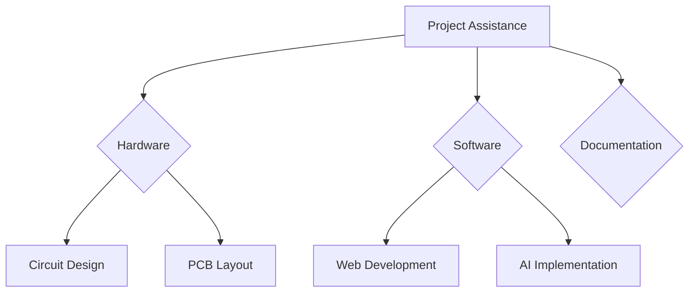

# Engineering Project Assistance 🛠️

> Professional assistance for academic and industrial engineering projects

[](https://github.com/HorizonHnk/engineering-project-assistance/stargazers) 
[](https://www.youtube.com/playlist?list=PLrZbkNpNVSwyFKBWqtk3LRIRVwC0O6Idn)

## 📌 Project Overview
A comprehensive platform offering technical assistance for:
- Final-year academic projects 🎓
- Professional engineering solutions 💼
- Industrial applications 🏭
- Software/Electrical/Embedded systems development 💻

**Core Technologies**:
```python
["JavaScript", "React", "Node.js", "Python", "C/C++", "Arduino", "STM32", "ESP32", "IoT", "AI/ML"]
```

## 🚀 Features
### Technical Services
- Hardware Development & Prototyping
- Custom Software Solutions
- Professional Documentation
- Weekly Progress Tracking
- Complete Project Implementation

### Key Components


## 📚 Resources
### Learning Materials
- Project tutorials
- Code samples
- Implementation guides
- Documentation templates

### Video Series
▶️ [YouTube Playlist](https://www.youtube.com/playlist?list=PLrZbkNpNVSwyFKBWqtk3LRIRVwC0O6Idn)

## 🛠 Installation
```bash
git clone https://github.com/HorizonHnk/engineering-project-assistance.git
cd engineering-project-assistance
# Install dependencies
npm install
# Start development server
npm start
```

## 🤝 Contribution
1. Fork the repository
2. Create your feature branch
3. Commit changes
4. Push to branch
5. Open Pull Request

**Before contributing**, please read our [Contribution Guidelines](CONTRIBUTING.md).

## 📬 Contact
For project inquiries and support:
✉️ Email: [hhnk3693@gmail.com](mailto:hhnk3693@gmail.com)

---

## YouTube Channel Description

**Channel Name**: Engineering Project Assistance Hub  
**URL**: https://www.youtube.com/playlist?list=PLrZbkNpNVSwyFKBWqtk3LRIRVwC0O6Idn

```
Professional engineering project support for students and professionals. 
Get assistance with software development, hardware design, documentation, 
and technical implementations.

🔗 GitHub Repository: https://github.com/HorizonHnk/engineering-project-assistance.git
🎥 Video Tutorials: https://www.youtube.com/playlist?list=PLrZbkNpNVSwyFKBWqtk3LRIRVwC0O6Idn

For inquiries and project support:
📧 Email: hhnk3693@gmail.com

#EngineeringProjects #TechnicalAssistance #AcademicHelp #SoftwareEngineering #HardwareDesign
```

### Hashtags
```
#EngineeringSolutions #ProjectSupport #STEMEducation #TechTutorials #EmbeddedSystems
#IoTProjects #AcademicSuccess #EngineeringStudents #ProgrammingHelp #ElectronicsProjects
```
